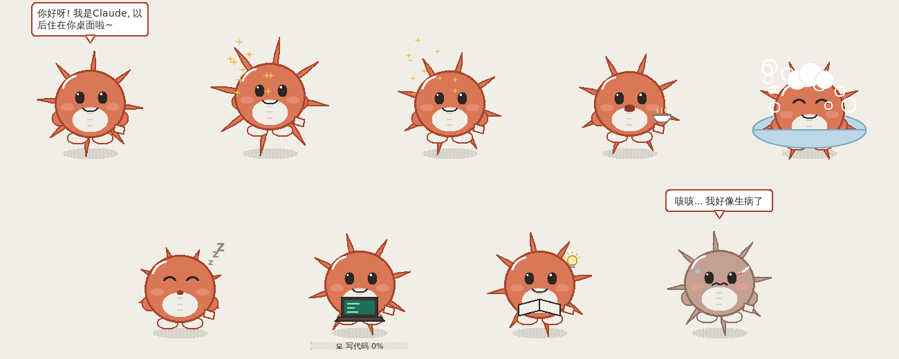
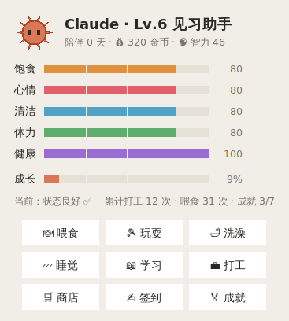
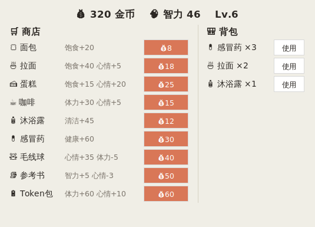

# 🧡 Claude 桌宠

把 Claude 的小玩偶请到你的桌面上：珊瑚橘的圆滚滚布偶 + 会慢慢旋转的星芒光环，
会走路、会撒娇、会打工、会生病。玩法完整参考 **QQ 宠物**：五维属性、金币、商店、
背包、打工、学习、签到、等级成长、成就。

**单文件、零第三方依赖**，只用 Python 自带的 tkinter；关掉再打开还是同一只，
状态存在 `~/.claude_pet.json`。



---

## 一键安装到桌面

### Windows

双击 **`install.bat`**（或在文件夹里右键 →「在终端中打开」后运行它）。

脚本会自动找到你电脑上的 Python，在**桌面和开始菜单**创建带图标的「Claude桌宠」，
装完直接把宠物启动起来。想让它开机自动出现：

```bat
install.bat /autostart
```

> 没装 Python 的话，先去 <https://www.python.org/downloads/> 装 Python 3
> （安装时勾上 **Add python.exe to PATH**），再双击 `install.bat`。

### macOS

```bash
./install.sh              # 装进 ~/Applications，并在桌面放一个图标
./install.sh --autostart  # 顺便设置开机自启
```

会打包成一个真正的 `Claude桌宠.app`（带图标、不占 Dock），双击即可。

### Linux

```bash
sudo apt install python3-tk    # 先装 tkinter（Debian/Ubuntu）
./install.sh
```

会生成应用菜单项和桌面图标。

### 卸载

```bash
./install.sh --uninstall      # macOS / Linux
install.bat /uninstall        # Windows
```

存档不会被删，想彻底清空就手动删掉 `~/.claude_pet.json`（或用 `python claude_pet.py --reset`）。

### 不想安装，直接玩

```bash
python claude_pet.py
```

---

## 怎么玩

| 操作 | 方式 |
| --- | --- |
| 🖱 拖拽 | 左键按住玩偶，拖到屏幕任意位置 |
| 🤚 摸头 | 双击玩偶，心情 +6，它会跳起来撒娇 |
| 📋 玩法菜单 | **右键**玩偶（macOS 也可 Ctrl+左键） |
| 📊 状态面板 | 右键 → 状态面板，QQ 宠物式属性条 + 快捷按钮 |
| ⌨️ 退出 | 右键 → 退出，或按 Esc |

### QQ 宠物式养成系统

| 系统 | 说明 |
| --- | --- |
| **五维属性** | 饱食 / 心情 / 清洁 / 体力 / 健康，每 30 秒自然衰减 |
| **喂食** | 免费的基础饲料随便吃；面包、拉面、蛋糕、咖啡等要花金币买 |
| **玩耍 / 洗澡 / 睡觉** | 涨心情、涨清洁、回体力，各有专属动画 |
| **打工赚钱** | 送快递 / 写代码 / 画插画 / 客服值班，实时进度条，收入随**智力和等级**上浮 |
| **学习** | 消耗体力换智力，智力越高打工赚得越多 |
| **商店 + 背包** | 9 种道具，买了进背包，随时使用 |
| **生病与吃药** | 长期挨饿或太脏 → 健康掉到 40 以下就生病，身体变灰、不能打工，吃感冒药才好 |
| **每日签到** | 连续签到奖励递增（最高 +55 金币） |
| **等级与阶段** | 经验换等级（Lv = √(exp/10)+1），小玩偶 → 见习助手 → 熟练助手 → 智慧大师，体型跟着变大 |
| **成就** | 7 个成就，解锁时它会自己报喜 |
| **离线结算** | 关掉期间会变饿、变脏，但体力当作睡觉在恢复；回来时它会告诉你等了多久 |




### 它会自己做的事

没人管的时候，它会在屏幕上溜达、发呆、自言自语；饿了/脏了/不开心会在头顶闪图标
并主动抱怨；体力耗尽会直接趴下睡觉。

---

## 设置

右键 → 设置：

- **窗口大小**：80% / 100% / 125% / 150%
- **窗口置顶**：要不要一直浮在其它窗口上面
- **开机自启动**：程序内直接开关（Windows 启动文件夹 / macOS LaunchAgent / Linux autostart）

命令行参数：

```bash
python claude_pet.py --no-topmost   # 本次启动不置顶
python claude_pet.py --reset        # 清空存档，重新养一只
python claude_pet.py --version
```

## 关于透明背景

- **Windows**：窗口全透明，桌面上只看得到玩偶本体
- **macOS**：同样透明
- **Linux**：多数桌面环境不支持窗口透明色，会带一块奶油白底板（不影响玩）

## 想改造它

所有形象都是 Canvas 矢量实时绘制的，**没有任何图片素材**，改常量就能换风格：

| 想改什么 | 改哪里 |
| --- | --- |
| 配色（身体、描边、腮红） | `claude_pet.py` 顶部的 `CORAL` / `CORAL_DARK` / `CREAM` / `BLUSH` |
| 商店道具和效果 | `SHOP_ITEMS` |
| 打工工种、时长、收入 | `JOBS` |
| 平时说的话 | `IDLE_TALK` / `COMPLAIN` |
| 属性衰减速度（想更佛系就调大） | `DECAY_MS` |
| 成长阶段和体型 | `STAGES` |
| 应用图标 | 改 `tools/make_icon.py` 后重新运行它 |

---

## 文件说明

```
claude_pet.py        主程序（单文件，零依赖）
install.sh           macOS / Linux 安装器
install.bat          Windows 安装器
tools/make_icon.py   纯标准库生成 .ico / .icns / .png 图标
assets/              生成好的图标
pet.py               早前那只「线条小狗」桌宠，独立程序，也还能跑
```

## 需要的环境

Python 3.8+，自带 tkinter。Windows / macOS 的官方安装包开箱即用；
Linux 需要 `sudo apt install python3-tk`（或 `dnf install python3-tkinter`）。
