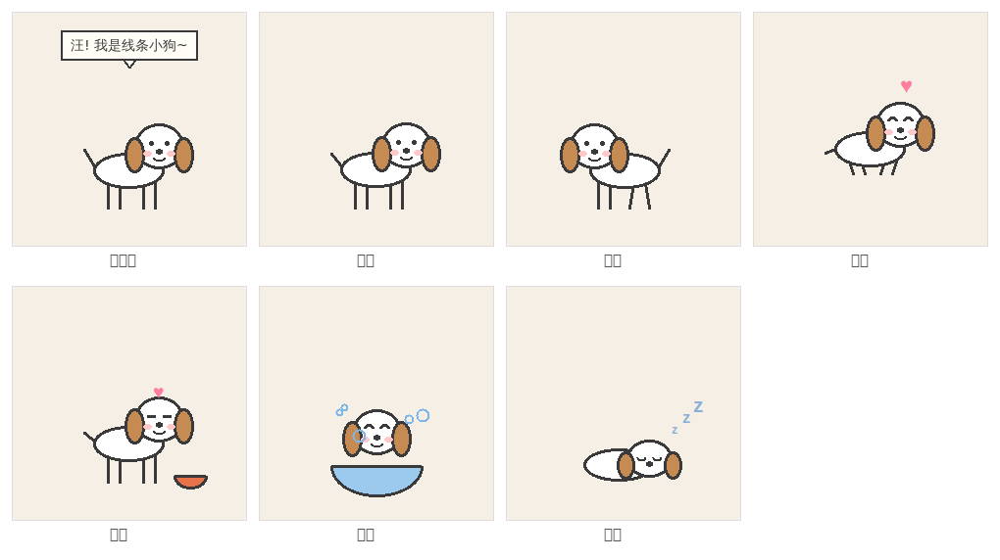
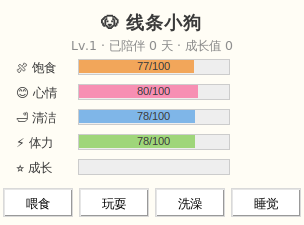

# 🐶 线条小狗桌宠

一只住在你桌面上的「线条小狗」，玩法参考经典 QQ 宠物：要喂食、要洗澡、会撒娇、会升级。
**单文件、零第三方依赖**，只用 Python 自带的 tkinter。



## 快速开始

```bash
python pet.py
```

- 需要 Python 3.8+（Windows / macOS 官方安装包自带 tkinter，开箱即用）
- Linux 需先安装 tkinter：`sudo apt install python3-tk`
- Windows 上可用 `pythonw pet.py` 启动，不带黑色控制台窗口
- Windows 下窗口背景全透明，只显示小狗本体；macOS / Linux 会带一块浅色底

## 玩法（QQ 宠物模式）

| 操作 | 方式 |
| --- | --- |
| 🖱️ 拖拽 | 左键按住小狗拖到任意位置 |
| 🤚 摸头 | 双击小狗，心情 +6，它会撒娇 |
| 🍖 喂食 | 右键菜单 → 喂食（骨头 / 肉肉 / 牛奶 / 冰淇淋，效果各不同） |
| 🎾 玩耍 | 心情大涨，但消耗体力和饱食度 |
| 🛁 洗澡 | 泡泡浴动画，恢复清洁值 |
| 💤 睡觉 | 恢复体力 |
| 📊 状态面板 | 右键菜单打开，QQ 宠物式属性条 |



### 数值系统

- **四维属性**：饱食 / 心情 / 清洁 / 体力，会随时间自然衰减（每 30 秒一次）
- **低值预警**：饿了、脏了、不开心时，小狗头顶会闪对应图标，还会主动用气泡向你抱怨
- **成长等级**：喂食、玩耍、洗澡、摸头都攒成长值，等级越高越难升（Lv = √(exp/10)+1）
- **自主行为**：没人管它时会自己在屏幕底部散步、发呆、说话，体力耗尽会自己趴下睡觉
- **持久存档**：状态自动保存到 `~/.linedog_pet.json`，关掉重开还是同一只狗；
  离线期间饱食度会缓慢下降（算它饿了），体力会恢复（算它睡了）

## 动画姿势

小狗全部用 Canvas 矢量线条实时绘制（没有任何图片素材），包含 6 套动画：

待机（摇尾巴、眨眼）· 散步（四条腿交替）· 开心（跳跃、耳朵扇动）· 吃饭 · 泡泡浴 · 睡觉（Zzz）

## 自定义

想调整外观和性格，直接改 `pet.py` 顶部的常量即可：

- `EAR` / `OUTLINE` / `BLUSH`：耳朵、线条、腮红颜色
- `FOODS`：食物菜单和加成
- `IDLE_TALK`：小狗平时说的话
- `DECAY_MS`：属性衰减速度（想要更佛系就调大）
